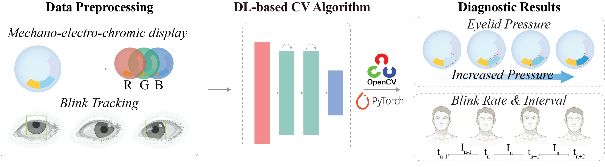
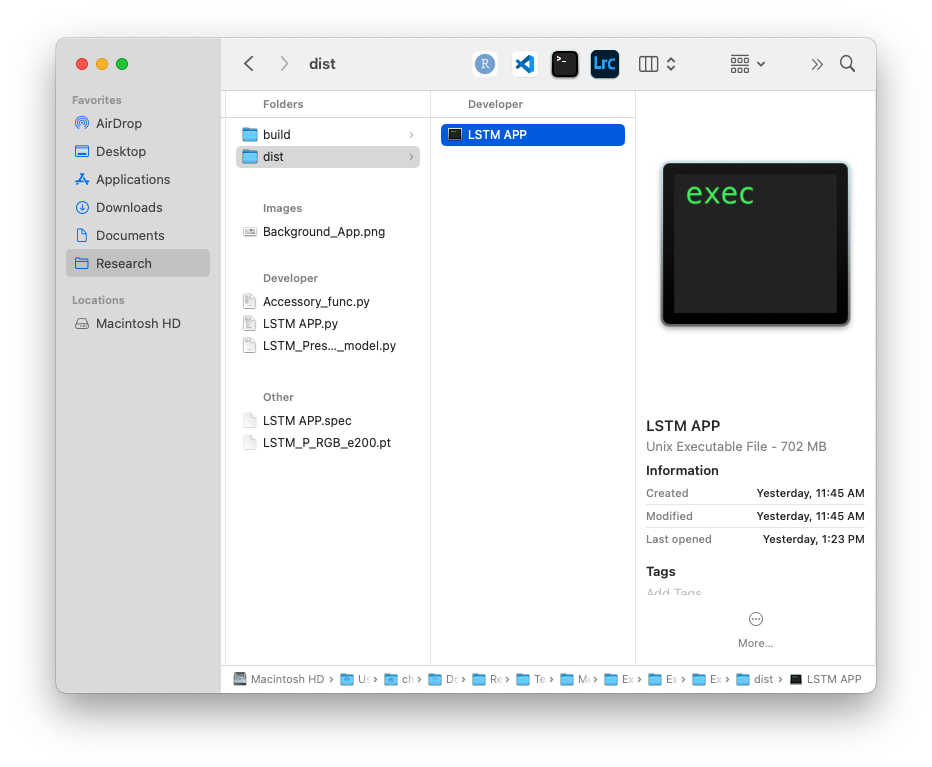

# OPTMISE
Welcome to the OPTMISE Github repository. **OPTMISE** stands for **O**cular **P**latform for **T**racking **M**echano-Electro-Chromic **I**ntelligent **S**ensing **E**-display. This repository contains the software component of OPTMISE complement to the mechanochromic material used for diagnosing dry eye syndrome (DES)! The mechanochromic SCL lens offers an **less invasive** measuring alternative to traditional methods that involve setting non-conformable foreign measuring apparatus between the eyeball and the eyelid. The customized software creates an interface to allow users to dynamically analyze the eye pressure captured by the mechanochromic lens, offering both the option to upload videos or use a built-in webcam to capture the change in color in real-time.



## Table of Contents
1. [Repo Structure](#repo-structure)
2. [Usage](#usage)
3. [Software in Action](#software-in-action)


This repository is meant as supporting material for the publication (publication link here).

## Repo Structure
```
OPTMISE/
│
├── docs/                       # Accessory files (images and gifs) for the README file
├── Accessory_func.py           # The accessory functions for the main code LSTM APP.py file
├── Background_APP.png          # The starting page of the software (KEEP this file! DO NOT remove!)
├── LSTM APP.py                 # Main code
├── LSTM APP.spec               # Pre-compiled software configuration file
├── LSTM_Pressure_RGB_model.py  # Model architecture file
├── P_RGBLSTM_e200.pt           # Model checkpoint
└── README.md                   # Project overview
```

## Usage

### Using the Code Directly
Download the code from the repo and follow the following checklist to ensure propoer functioning of the code:
- [ ] Make sure the python file is correctly downloaded
- [ ] Do not delete or remove any files from the downloaded folder
- [ ] Make sure the reference to directory is correct
- [ ] Make sure the reference to the `.pt` file name is correct
- [ ] Run the `LSTM APP.py` file

### Using the OPTMISE Software
Make sure you have pip installed on your device, change to the directory that you want to store the software dependencies at, and clone this repository:
```bash
cd /desired_directory
git clone [repository link]
```
The metadata of the software is contained in the `LSTM APP.spec` file and requires the `pyinstaller` module in Python (refer to official documentary: [pyinstaller link](https://pyinstaller.org/en/stable/)). To install the pyinstaller module, please use:
```bash
pip install pyinstaller
pip3 install pyinstaller
```
Then, locate the folder that contains the `LSTM APP.spec` file and run the following:
```bash
pyinstaller LSTM\ APP.spec
```

This will create two new folders titled 'build' and 'dist'. The executable file in the 'dist' folder will be the runnable software.

### Software in Action
