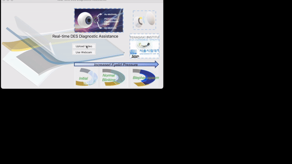

# DES_Diagnosis
Welcome to the Github repository for the software complementary to the mechanochromic material used for diagnosing dry eye syndrome (DES)! The mechanochromic SCL lens offers an **less invasive** measuring alternative to traditional methods that involves setting non-conformable foreign measuring apparatus between the eyeball and the eyelid. The customized software creates an interface to allow users to dynamically analyze the eye pressure captured by the mechanochromic lens, offering both the option to upload videos or using built-in webcam to capture the change in color in real-time.



This repository is meant as supporting material for the publication (publication link here).

## Installation
### MacOS
Make sure you have pip installed on your device, change to the directory that you want to store the software dependencies at, and clone this repository:
```bash
cd /desired_directory
git clone [repository link]
```
The metadata of the software is contained in the `LSTM APP.spec` file and requires the `pyinstaller` module in Python. To install the pyinstaller module, please use:
```bash
pip install pyinstaller
pip3 install pyinstaller
```
Then, locate the folder that contains the `LSTM APP.spec` file and run the following:
```bash
pyinstaller LSTM\ APP.spec
```
This will create two new folders titled 'build' and 'dist'. The executable file in the 'dist' folder will be the runnable software.
### Windows