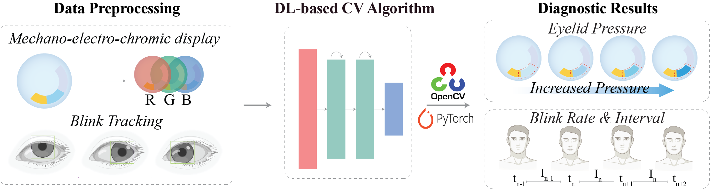
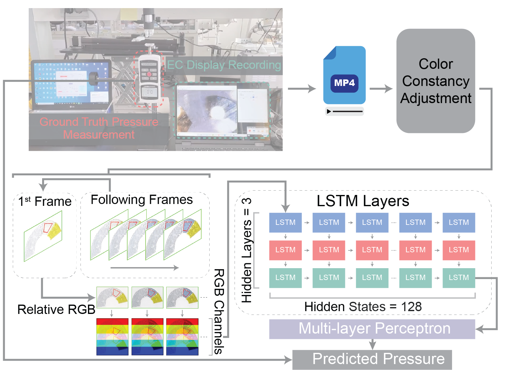

# OPTMISE
Welcome to the OPTMISE Github repository. **OPTMISE** stands for **O**cular **P**latform with **T**elemetric **M**echano-Electro-Chromic **I**ntelligent **S**ensing **E**cosystem. This repository contains the software component of OPTMISE complement to the mechanochromic material used for diagnosing dry eye syndrome (DES)! The mechanochromic SCL lens offers an **less invasive** measuring alternative to traditional methods that involve setting non-conformable foreign measuring apparatus between the eyeball and the eyelid. The customized software creates an interface to allow users to dynamically analyze the eye pressure captured by the mechanochromic lens, offering both the option to upload videos or use a built-in webcam to capture the change in color in real-time. The following figure is the project pipeline.


## Table of Contents
1. [Repo Structure](#repo-structure)
2. [Usage](#usage)
    1. [Using the Code Directly](#using-the-code-directly)
    2. [Using the OPTMISE Software](#using-the-optmise-software)
3. [Software in Action](#software-in-action)
    1. [Mockup Setup Demo](#mockup-setup-demo)
    2. [Animal & Human Study Demo](#animal--human-study-demo)
4. [Project Descriptions](#project-descriptions)
    1. [Motivation](#motivation)
    2. [Model Logic](#model-logic)

## Repo Structure
```
OPTMISE/
│
├── docs/                       # Accessory files (images and gifs) for the README file
├── Accessory_func.py           # The accessory functions for the main code LSTM APP.py file
├── Background_APP.png          # The starting page of the software (KEEP this file! DO NOT remove!)
├── LSTM APP.py                 # Main code
├── LSTM APP.spec               # Pre-compiled software configuration file
├── LSTM_Pressure_RGB_model.py  # Model architecture file
├── P_RGBLSTM_e200.pt           # Model checkpoint
└── README.md                   # Project overview
```

## Usage

### Using the Code Directly
Download the code from the repo and follow the following checklist to ensure propoer functioning of the code:
- [ ] Make sure the python file is correctly downloaded
- [ ] Do not delete or remove any files from the downloaded folder
- [ ] Make sure the reference to directory is correct
- [ ] Make sure the reference to the `.pt` file name is correct
- [ ] Run the `LSTM APP.py` file

### Using the OPTMISE Software
Make sure you have pip installed on your device, change to the directory that you want to store the software dependencies at, and clone this repository:
```bash
cd /desired_directory
git clone [repository link]
```
The metadata of the software is contained in the `LSTM APP.spec` file and requires the `pyinstaller` module in Python (refer to official documentary: [pyinstaller link](https://pyinstaller.org/en/stable/)). To install the pyinstaller module, please use:
```bash
pip install pyinstaller
pip3 install pyinstaller
```
Then, locate the folder that contains the `LSTM APP.spec` file and run the following:
```bash
pyinstaller LSTM\ APP.spec
```

This will create two new folders titled 'build' and 'dist'. The executable file in the 'dist' folder will be the runnable software.

### Software in Action
#### Mockup Setup Demo
The software supports both real-time monitoring through the computer's webcam and analysis of pre-recorded close-up videos of the OPTMISE on the subject's eye. This dual functionality enables immediate analysis and the generation of in-situ recordings, which is especially useful for clinical applications and telemedicine, allowing users to self-record videos that clinicians can later analyze remotely.


Upon launching the software:
1. Users are first prompted to select the eye region by diagonally dragging the cursor to outline the lens area. This crucial step ensures that the subsequent processing, guided by an eye-tracking algorithm, occurs only when the OPTMISE is clearly visible, preventing issues such as eyelid obstruction or missed captures due to eye movement. If visibility is compromised, the software displays an error message, indicating a failure in pressure measurement. 
2. Define the ROI region by clicking on the polygonal vertices, after which pressure predictions per frame are calculated and displayed on the upper-left corner of the screen.
3. Hit enter again to start the vide analysis and the analysis results are displayed at the top left corner of the screen.

#### Animal & Human Study Demo
| Animal Study | Human Study |
|:-------:|:-------:|
|  |  |

### Project Descriptions
#### Motivation
Eyelid movements play a crucial role in maintaining ocular health, and specific blink patterns have been associated with ocular surface disorders, neurological conditions, and systemic health issues. Current monitoring tools are limited by their reliance on external sensors or invasive designs, making it challenging to capture realistic blink behaviors over extended periods.

To address these limitations, OPTMISE integrates a triboelectric nanogenerator (TENG) and a mechano-electro-chromic display (MECD) into soft contact lenses, enabling non-invasive and continuous monitoring of eyelid pressure through color changes. This design ensures comfort and compatibility with daily activities while maintaining long-term measurement stability.

The software component of OPTMISE utilizes a deep learning-driven computer vision system that analyzes time-series RGB data to quantify blink patterns such as eyelid pressure, blink rate, and inter-blink intervals. By combining these advanced hardware and software features, the platform provides a comprehensive and nuanced understanding of ocular and systemic health, and has the potential to revolutionize human-machine interactions.

#### Model Logic
The pressure quantification model is based on a stacked Long Short-Term Memory (LSTM) architecture combined with a multi-layer perceptron to predict eyelid pressure based on RGB values in a specified region of interest (ROI). The model incorporates a lookback mechanism to capture temporal dependencies by considering RGB values from previous frames. It was trained using PyTorch, with batches of 32 samples over 200 iterations. The Adam optimizer was used for optimization, and the Mean Square Error (MSE) loss function quantified the difference between predicted and actual pressure values.

